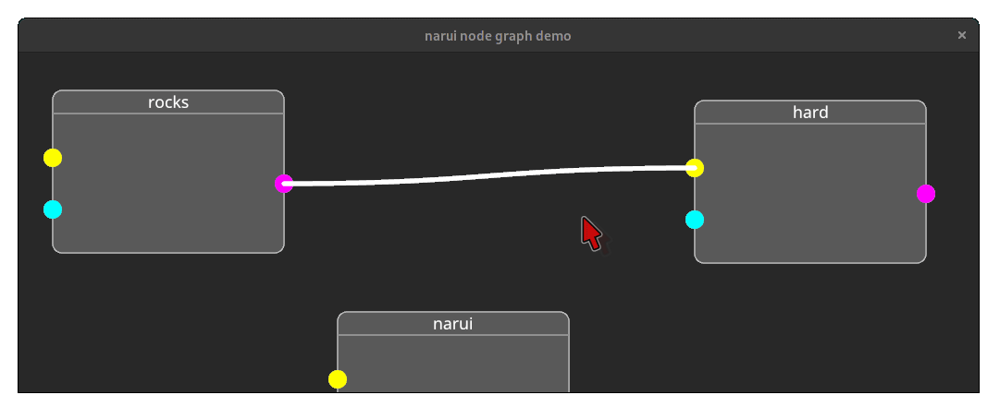

<h1 align="center"><code>narui</code></h1>

A react-inspired UI library for building multimedia desktop apps with rust and vulkan.

* declarative UI with Ergonomics similar to React with hooks
* JSX-like syntax for composing widgets
* clean, readable & familiar looking application code
* flutter-style box layout algorithm



## Usage
Here is a small introduction of the basic concepts of `narui`. Many things might sound familiar if you used modern react or flutter. 

Make sure to also check out [the examples](examples/) that cover some more advanced topics and contain more complicated code.

### Basics

`narui` UIs are composed of `widgets`. These building blocks can be anything from a simple box to a complex node graph node or even a whole application. The widgets of an application form a tree, that is partially re-evaluated when needed.

`widgets` are functions that are annotated with the `widget` attribute macro and return either `Fragment` for composed widgets or `FragmentInner` for primitive widgets.

```rust
#[widget]
pub fn square(context: &mut WidgetContext) -> Fragment {
    rsx! {
        <rect fill=Some(color!(#ffffff)) constraint=BoxConstraints::tight(10.0, 10.0)>
    }
}
```

The widgets that are defined that way can then be used in other widgets or as the application toplevel via the rsx macro:
```rust
fn main() {
    render(
        WindowBuilder::new(),
        rsx_toplevel! {
            <square />
        },
    );
}

```


### Composition

`narui` follows the principle of composition over inheritance: You build small reusable pieces that then form larger widgets and applications. To enable that, `narui` widgets can have parameters and children.

```rust
#[widget(color = color!(#00aaaa))]  // we assign a default value to the color attribute which is used when color is unspecified
pub fn colored_column(children: FragmentChildren, color: Color, context: &mut WidgetContext) -> Fragment {
    rsx! {
        <rect fill=Some(color)>
            <padding padding=EdgeInsets::all(10.0)>
                <column>
                    {children}
                </column>
            </padding>
        </rect>
    }
}
```

We can then use that widget like this:
```rust
rsx! {
    <colored_container>
        <text>{"Hello, world"}</text>
        <square />
    </colored_container>
}
```

If we programmatically generate multiple widgets (for example to display a list), we have to manually specify a `key` so that each widget can be uniquely identified:
```rust
rsx! {
    <colored_container>
        {
            (0..10).map(|i| {
                rsx! { 
                    <text key=&i> // <-- explicit key is given here
                        {format!("{}", i)}
                    </text> 
                }
            })
        }
    </colored_container>
}
```


### State, Hooks & Input handling

The `context`, that is passed to every widget, acts like a pointer into the widget tree (and can therefore be cheaply copied), and is used to associate data to a specific widget.

State management in `narui` is done using `hooks`. 
Hooks work similiar to react hooks. The most simple hook is the `context.listenable` hook, which is used to store state. Widgets can subscribe to `Listenable`s with the `context.listen` method and get reevaluated when the state that they listen to changed. Similiarily, the value of a listenable can be updated by using the `context.shout` method.

```rust
#[widget(initial_value = 1)]
pub fn counter(initial_value: i32, context: &mut WidgetContext) -> Fragment {
    let count = context.listenable(initial_value);
    let on_click = move |context: &CallbackContext| {
        context.shout(count, context.spy(count) + 1)
    };

    rsx! {
        <button on_click=on_click>
            <text>
                {format!("{}", context.listen(count))}
            </text>
        </button>
    }
}
```

### Animations

Usually widgets change state in reaction to a outside event like a mouse click or a message sent over a mpsc channel. Sometimes however it can be useful to drive a state change by the widget itself (for example to create animations).
Listenables should not be updated during the evaluation of a widget but only in reaction to external events. This way, re-render loops can be avoided in a clean and easy way.

To create animations despite the existance of that rule, one can use the `context.after_frame` hook, which allows widgets to run a closure after each frame is rendered. This allows widgets to change `Listenables` in each frame and therefore create animations.


### Business logic interaction & interfacing the rest of the world

Interaction with non UI-related code should be done similiar to how interaction with UI related code is done: 
* `Listenables` should signal the state from business logic to the UI.
* Events should signal input from the UI to the business logic. This can be simple callbacks as you would to in your UI code, but it can also be more complicated with `mpsc`s or comparable techniques.

The first step of interacting with Business logic is to run it. This can be done with the `effect` hook manually or by using the `thread` hook as a utility over that. For a simple example of how that can be acomplished, see [examples/stopwatch.rs](examples/stopwatch.rs).


### Custom rendering

`narui` allows `widget`s defined in downstream application code to emit fully custom vulkan api calls including drawcalls. This is especially important for multimedia applications. Example widgets that could be implemented this way are 3D viewports, image / video views and similiar things.
